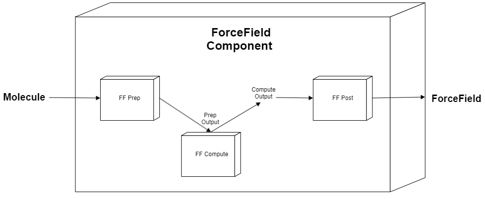

MMComponent for Forcefield Parametrization
==============================

[//]: # (Badges)

A component for generating parametrized molecules.

Supported engines:
- [Auto Martini](https://github.com/tbereau/auto_martini): automated [MARTINI](http://www.cgmartini.nl) forcefield mapping and parametrization of small organic molecules.

#### Acknowledgements
 
Project based on the 
[Computational Molecular Science Python Cookiecutter](https://github.com/molssi/cookiecutter-cms) version 1.1.
