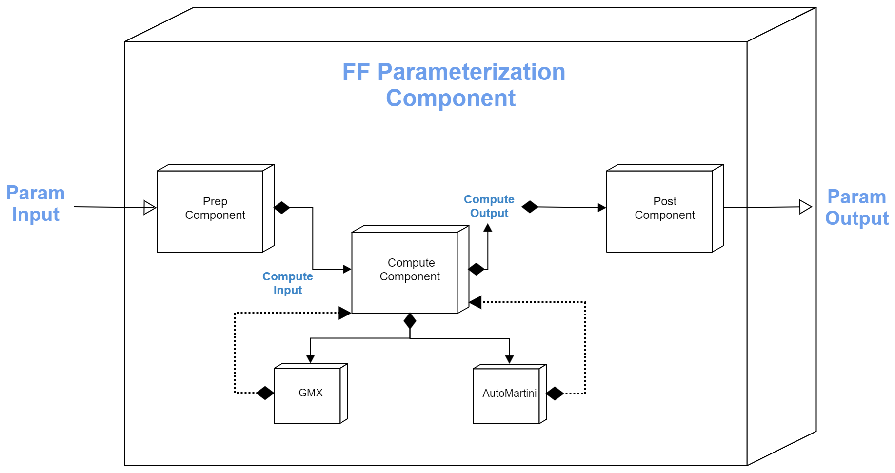

Forcefield parametrization component
========================================

[//]: # (Badges)

A component for generating parametrized molecules from existing force fields.

Supported forcefields:
- [Amber94](https://pubs.acs.org/doi/abs/10.1021/ja00124a002): Second Generation Amber-based force field for the simulation of proteins, nucleic acids, and organic molecules
- [Amber96](): 
- [Amber99](): 
- [Amber99-ILDN]
- [Amber99SB-ILDN](https://pubmed.ncbi.nlm.nih.gov/20408171): Amber-based force field which improves side-chain torsion potentials for the Amber ff99SB protein force field. 
- [Amber03](https://onlinelibrary.wiley.com/doi/abs/10.1002/jcc.10349): Point‐charge force field for molecular mechanics simulations of proteins
- [AMBERGS]
- [Martini](https://pubs.acs.org/doi/10.1021/jp071097f#:~:text=The%20new%20version%2C%20coined%20the,large%20number%20of%20chemical%20compounds):  Coarse-grained force field for biomolecular simulations & organic molecules.
- [Charmm27]():
- [Gromos96-43a1]
- [Gromos96-43a2]
- [Gromos96-45a3]
- [Gromos96-53a5]
- [Gromos96-53a6]
- [Gromos96-54a7]
- [OPLS-AA](https://pubs.acs.org/doi/abs/10.1021/jp003919d): OPLS-based force field for proteins

Supported engines:
- [GMX pdb2gmx](https://manual.gromacs.org/documentation/5.1/onlinehelp/gmx-pdb2gmx.html): part of the [Gromacs](https://www.gromacs.org) software suite
- [Auto Martini](https://github.com/tbereau/auto_martini): automated [MARTINI](http://www.cgmartini.nl) forcefield mapping and parametrization of small organic molecules.

#### Acknowledgements
 
Project based on the 
[Computational Molecular Science Python Cookiecutter](https://github.com/molssi/cookiecutter-cms) version 1.1.
