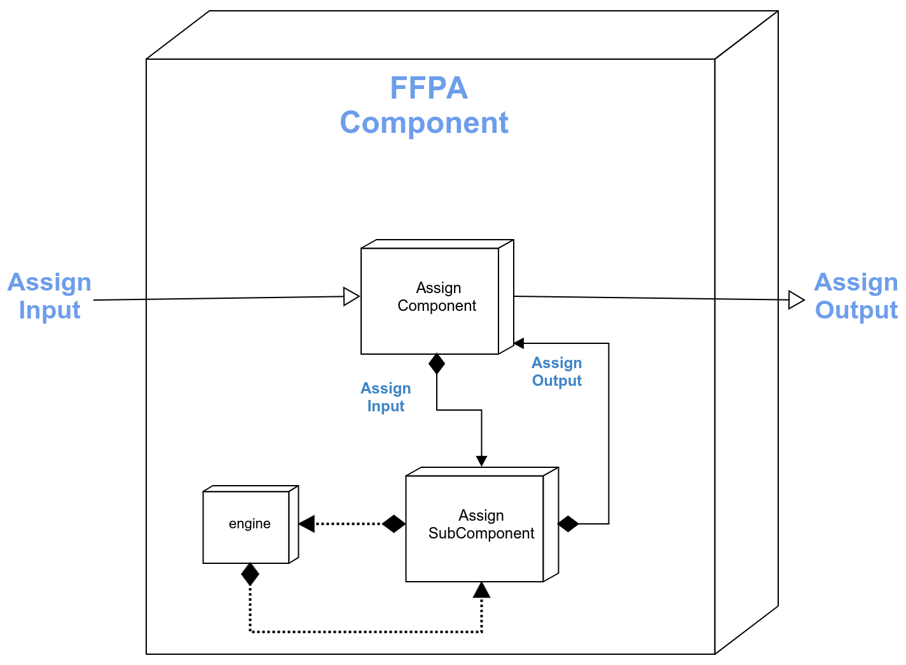

[//]: # (Badges)
[](https://github.com/MolSSI/mmic_ffpa/actions?query=workflow%3ACI)
[](https://codecov.io/gh/MolSSI/mmic_ffpa/branch/master)
[](https://lgtm.com/projects/g/MolSSI/mmic_ffpa/context:python)

Forcefield param assignment component
========================================
This is part of the [MolSSI](http://molssi.org) Molecular Mechanics Interoperable Components ([MMIC](https://github.com/MolSSI/mmic)) project. This package provides a component for generating parameterized molecules from existing force fields.

<p align="center">

</p>

# Basic Usage
```python
# Import main component for running the computation
from mmic_ffpa import RunComponent

# Import the param input and molecule models that comply with MMSchema
from mmic_ffpa.models.input import ParamInput
from mmelemental.models.molecule import Molecule

# Create an MMSchema molecule
mol = Molecule.from_file(path_to_file)

# Create input for Amber99 FF (optionally) using the GMX engine
paramInput = ParamInput(mol=mol, forcefield='amber99', engine='gmx')
paramOutput = RunComponent.compute(paramInput)

# Extract MMSchema mol and its associated ff object
mol, ff = paramOutput.mol, paramOutput.ff
```

# Models and subcomponents
This component provides 4 models derived from MMSchema: 
- [ParamInput](https://github.com/MolSSI/mmic_ffpa/blob/master/mmic_ffpa/models/input.py#L8)
- [ComputeInput](https://github.com/MolSSI/mmic_ffpa/blob/master/mmic_ffpa/models/input.py#L14)
- [ParamOutput](https://github.com/MolSSI/mmic_ffpa/blob/master/mmic_ffpa/models/output.py#L12)
- [ComputeOutput](https://github.com/MolSSI/mmic_ffpa/blob/master/mmic_ffpa/models/output.py#L8)

```python
from mmic_ffpa.models.input import ParamInput, ComputeInput, ParamOutput, ComputeOutput
```

This package provides 3 components for assigning force field parameters to a given MMSchema molecule: 
- [PrepComponent](https://github.com/MolSSI/mmic_ffpa/blob/master/mmic_ffpa/components/prep_component.py#L7)
- [ComputeComponent](https://github.com/MolSSI/mmic_ffpa/blob/master/mmic_ffpa/components/post_component.py#L5)
- [PostComponent](https://github.com/MolSSI/mmic_ffpa/blob/master/mmic_ffpa/components/post_component.py#L5)

```python
from mmic_ffpa.components import PrepComponent, ComputeComponent, PostComponent
```

#### Acknowledgements
 
Project based on the 
[Computational Molecular Science Python Cookiecutter](https://github.com/molssi/cookiecutter-cms) version 1.1.
