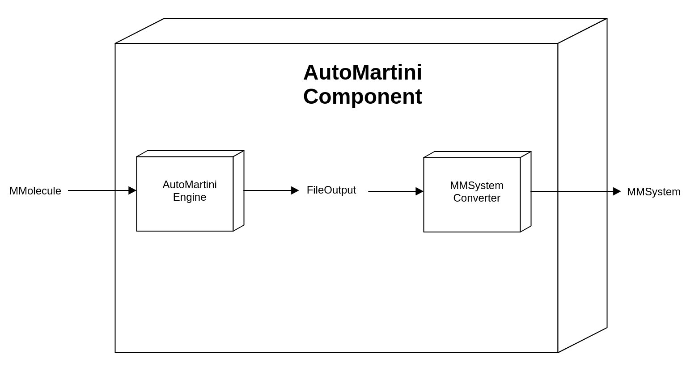

MMComponents_AutoMartini
==============================
[//]: # (Badges)

A toolkit that enables automatic generation of MARTINI forcefields for small organic molecules. See github [repo](https://github.com/tbereau/auto_martini) for original code.

### Copyright

Copyright (c) 2020, Andrew Abi-Mansour

#### Acknowledgements
 
Project based on the 
[Computational Molecular Science Python Cookiecutter](https://github.com/molssi/cookiecutter-cms) version 1.1.
